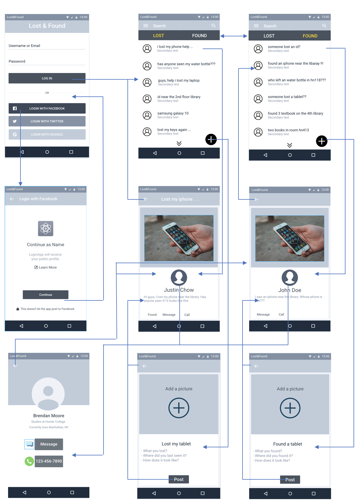

# Android Final Project

## Table of Contents

1. [Introduction](#Introduction)
2. [Getting Started](#Getting-Started)
3. [Usage](#Usage)
4. [Wireframe](#Wireframe)
5. [Technologies](#Technologies)
6. [UML](#Unified-Modeling-Language)
7. [Testing](#Testing)
8. [Pitfalls](#Pitfalls)
9. [Contributor](#Contributor)

## Introduction

Lost&Found is an android application that allows CUNY students to post what they lost or found. 

The application has two main screen, Lost and Found tab. Lost tab is for user who lost their items on campus, whether it’s laptop or water bottle. The Found tab is for user who found items through the campus, for example school ID. 

Users can create post by taking a photo and writing a description of the lost/found item. 

The owner of the item can contact the user who found the item through Message, Call or Track features. Users can message each other by using the built-in messaging system. Users can also call if preferred. 

To return the item to the owner, user can use the Track feature. The Track is a feature that send an email to the user who found the item so that he/she can contact the owner of the item. 

User must fill out a form to verify the user identify, e.g. full name, school id, phone number. 

Then the user need to sign the form through the built-in signature pad to accept the terms and conditions.

## Getting Started 

## Usage
To use this app, first create an account through the app. Then, verify the account using the email you provided. After verifying,login and click on the hamburger menu to go to profile. In the profile section,fill out your information and save. Now,you can create and view posts.

## Case Diagram

## Technologies
- Android
- Firebase

## Wireframe    

## Unified Modeling Language

**Activities**  
LoginActivity - Activity for user to enter their email and password.   

RegisterActivity - Activity for user to register for an account using their email and password.   

MainActivity​ - Home activity for user to view between the Lost & Found tab to see other users' post. 

MessageActivity ​- Activity to allow user to message another user.

MessageViewActivity ​- Activity to view chats the user has created.

PostActivity​ - Activity to allow user to post for a lost or found item.

PostViewActivity​ - Activity to view other user’s post, either lost or found.

ProfileActivity​ - Activity to view the user's profile and edit user's information.

ProfileViewActivity​ - Activity to view other user's profile

**Fragments**

LostFragment - Fragment of the Lost tab.

FoundFragment​ - Fragment of the Found tab.

**Classes**

Message ​- Class to hold a message data e.g. user and message.  

MessageList ​- Class to hold all message data of that user.  

Post ​- Class to hold a post information e.g.title and description.  

PostList ​- Class to hold all post data of either Lost or Found tab.  

SecurityQuestions​ - Class to hold the security questions when a user want to track and contact other user.  

Upload ​- Class to hold the post image url.   

User ​- Class to hold a user information e.g. name, phonenumber, id,and school  

GMailSender ​- Class to send email to a user gmail account when a user is using track feature.  

JSSEProvider​ - Class to send email to a user gmail account when a user is using track feature.

**Adapters**

MessageAdapter​ - Extends ArrayAdapter to populates a list of messages into a messageview.

MessageViewAdapter​ - Extends ArrayAdapter to populates a list of chats into a chatting view.

PostAdapter ​- Extends ArrayAdapter to populates a list of posts into a Lost or Found fragment view.  

ViewPagerAdapter​ - Extends FragmentPagerAdapter to add fragments,lost & found, to switch between lost & found tab.

## Testing
Email: lostfoundee32f@gmail.com

## Pitfalls
Due to lack of time I was not able to implement input checking. If the user create a post without image, title, or description it will crash the app.If a newly created user did not go to Profile and set up their credential it will crash the app. Any unexpected input from user will most likely crash the app.

## Contributor  
Ho Ming Poon
